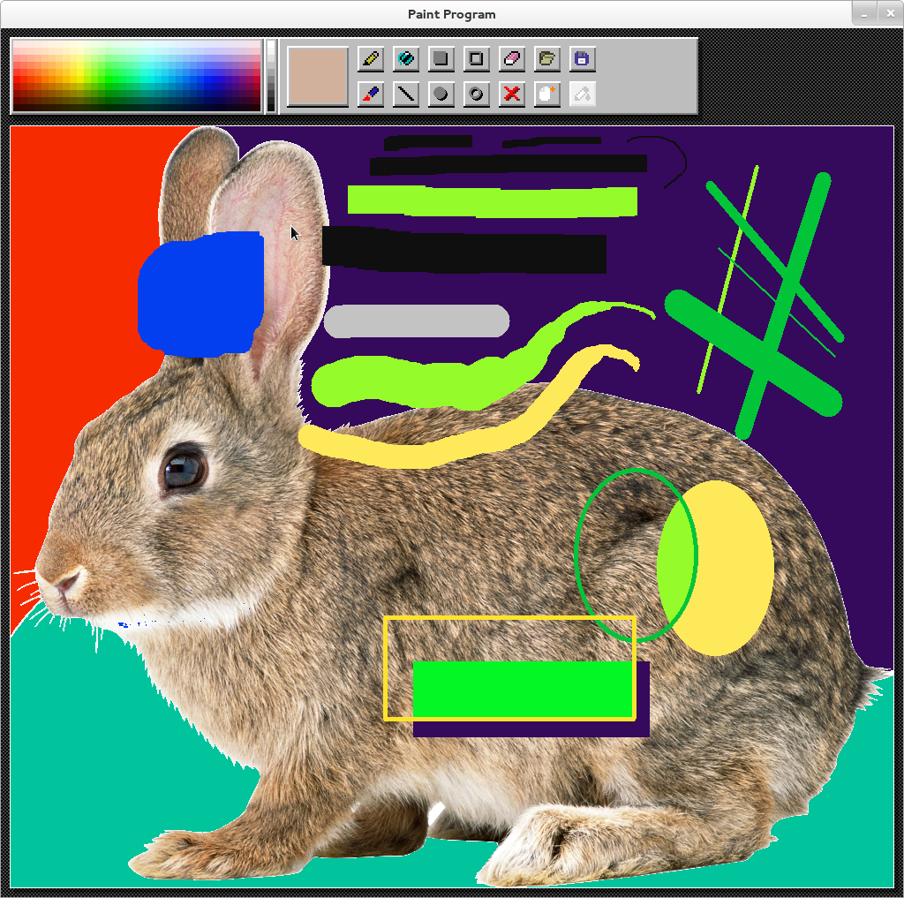

# paint
After digging through some old files recently, I rediscovered one of my first projects whilst learning C - an assignment from my first year of university (late 2016). The assignment was to create a working MS paint-like program using C and SDL. The `initial commit` of this repository represents the state of the assignment upon submission, so expect it to be buggy!

<!---

--->


This program implements the following:
- Loading and saving images to disk
- Pencil (square brush) and Paint (round brush)
- Outlined and filled ellipses
- Outlined and filled rectangles
- Eraser
- Colour picker (eyedropper)
- Flood fill

## Compiling
This project should only depend on `sdl2-devel` and `sdl2-image-devel` from your OS's package manager - to compile and run:
```
make; ./paint
```

